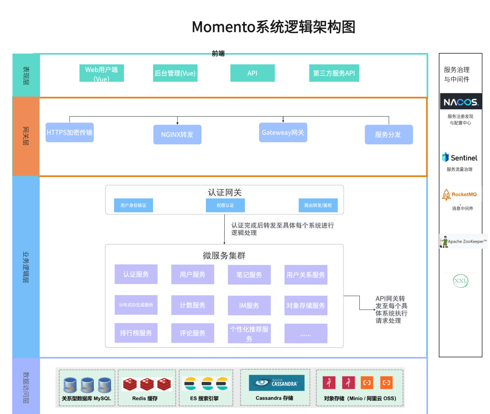
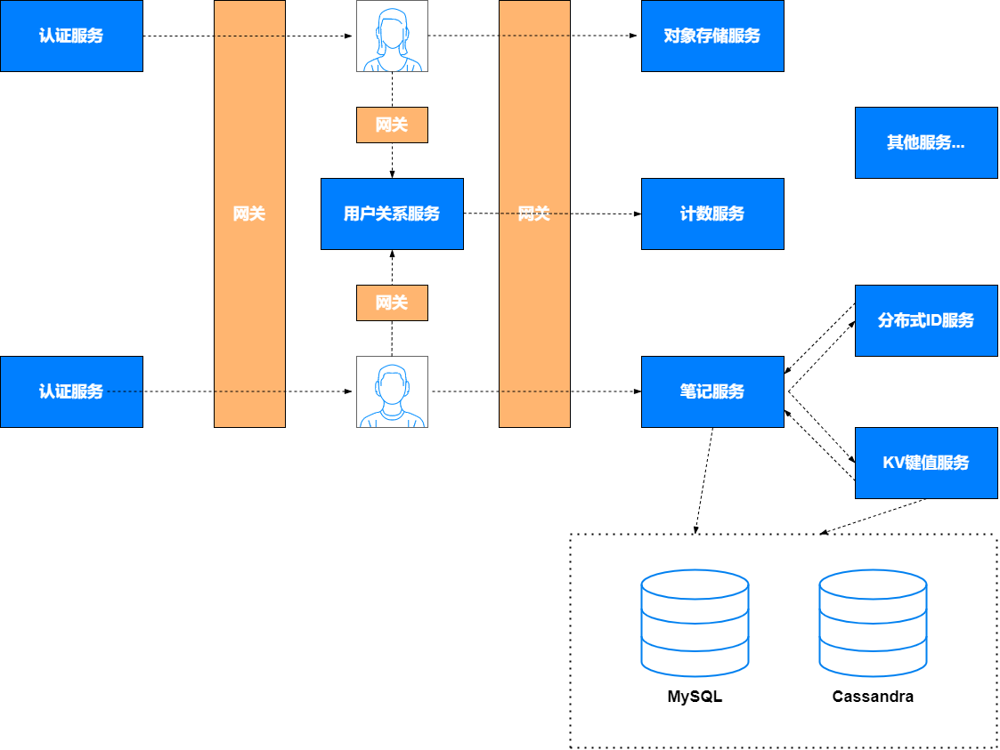

# 项目提案：Momento（生活分享与社交互动平台）

**项目成员：**

2250763 李俊旻

2254272 赵子毅

2253551 李沅衡

[TOC]

## 1. 项目概述

### 1.1 背景

随着社交媒体和内容平台的迅速普及，用户愈发依赖在线平台来分享其生活、思想和经验，特别是在内容创作和兴趣社区互动领域，用户对个性化、实时性以及高可用性的需求持续上升。同时，随着用户基数的急剧增长，平台需要具备处理高并发读写请求的能力，以确保用户操作的实时响应和数据一致性。

### 1.2 动机

现有的内容分享和社交平台在应对高并发处理、个性化推荐、用户隐私保护和数据安全等方面存在显著不足。本项目通过采用先进的分布式架构和微服务设计，旨在解决这些局限性，为用户提供一个更稳定、高效且个性化的内容分享与社交互动平台。

### 1.3 项目目的与范围

本项目旨在构建一个内容分享与社交互动平台，支持用户发布笔记、点赞、收藏、关注等功能，满足用户对社交和内容分享的高标准需求。项目采用微服务架构，以应对海量用户的高并发需求，确保平台的高可用性和高扩展性。通过分布式架构实现数据一致性和实时响应，结合创新的社区互动方式，提升用户体验。项目的范围定义清晰，确保小组成员在开发过程中保持一致的理解，并明确项目的边界和交付物。

#### 1.3.1 项目目标

Momento 项目的核心目标是构建一个稳定、高效、可扩展的内容分享与社交互动平台，满足用户在高并发环境下对个性化内容推荐、实时互动和数据一致性的需求。该平台的具体目标包括：

- **高并发支持**：通过分布式架构和微服务设计，确保平台在海量用户并发访问时的高可用性和高扩展性，保证用户操作的实时响应。
- **内容创作与管理**：支持用户发布、编辑、删除笔记，允许用户为笔记设置标签、置顶和管理笔记的可见性，提升用户的内容管理体验。
- **社交互动**：实现用户之间的点赞、评论、关注等社交操作，增强社区互动，并通过实时通知确保用户能够及时获取互动信息。
- **个性化推荐**：基于用户行为数据和机器学习算法，提供个性化内容推荐，提升用户的内容发现效率和粘性。
- **高可用性与数据一致性**：通过消息队列和缓存策略确保系统在高并发下的数据一致性与稳定性，提升用户体验的流畅性。

#### 1.3.2 项目交付物

Momento 项目将交付以下主要功能模块，涵盖平台的核心功能需求：

- **笔记管理**：允许用户发布、编辑、删除笔记，支持设置笔记可见性（如公开、仅好友可见、私密），并提供笔记置顶、标签分类等功能。
- **用户互动**：支持用户对笔记进行点赞、评论和收藏操作。评论功能支持多层回复，增强用户互动体验。
- **用户关系**：实现用户的关注与取关操作，帮助用户建立社交网络，并提供关注者和粉丝列表的查看功能。
- **通知服务**：提供用户互动的实时通知（如点赞、评论、关注通知），确保用户可以及时掌握动态。
- **认证与授权**：支持用户注册、登录、密码管理和身份验证功能，使用 JWT 进行认证，并采用 RBAC 权限控制模型。
- **标签与话题**：用户可以为笔记添加标签，并参与话题讨论，促进社区的互动活跃性。
- **内容推荐**：基于用户的行为数据，使用机器学习算法提供个性化推荐，帮助用户发现感兴趣的内容。
- **搜索功能**：支持通过关键词、标签、用户和话题进行搜索，基于 Elasticsearch 提供高效的内容检索。
- **后台管理系统**：为管理员提供审查、管理用户内容、监控平台运行状态的工具，确保平台合规运营。
- **分布式存储与缓存**：采用 Redis、Minio 和 Cassandra 等技术，保障平台在高并发环境下的数据存储和高效缓存。

#### 1.3.3 项目边界

为了确保项目的聚焦性，Momento 平台的开发将专注于上述功能模块。以下内容不包括在项目范围内：

- 第三方社交平台的整合。
- 视频直播及其他媒体形式的支持。
- 电商、广告管理等业务扩展功能。

#### 1.3.4 项目约束与假设

- **约束条件**：平台需具备高可用性和数据一致性，在面对大量用户并发操作时，必须保持稳定。数据隐私和安全是项目的首要考虑，所有用户交互和数据存储必须符合相关的安全规范。
- **假设条件**：假设用户希望通过个性化推荐和实时通知功能提升平台的互动性，同时假设系统能够通过分布式架构有效应对高并发需求。

#### 1.3.5 验收标准

为了确保项目的成功交付，Momento 项目的验收标准包括：

- **功能完整性**：平台的核心功能能够正常使用，并满足用户需求。
- **高并发支持**：平台在高并发环境下能够稳定运行，数据一致性和用户操作的实时性得到保障。
- **性能测试通过**：系统通过压力测试，满足平台高可用和高扩展性要求。
- **后台管理功能**：管理员可以通过后台管理系统有效管理用户内容并确保平台合规运行。

#### 1.3.6 范围变更管理

任何范围变更必须通过小组讨论并获得批准后方可实施。项目的范围变更需要对项目时间表、资源分配及其他相关文档进行相应的更新，以确保变更对项目的影响最小化。

## 2. Main Functionalities

### 2.1 笔记与评论服务

- 用户可以发布、编辑、删除笔记，支持设置笔记的可见权限（公开、仅好友可见、私密）。

- 支持笔记置顶功能，便于用户展示重要内容。

- 评论服务支持嵌套评论与多层回复，用户可以通过评论与其他用户互动。

### 2.2 点赞与收藏服务

- 用户可以对笔记进行点赞、取消点赞，以及收藏笔记功能。

- 收藏功能支持分类管理，用户可以对收藏的笔记进行分类保存，方便管理收藏内容。

- 点赞、收藏操作会触发相关的通知与计数服务，确保用户的互动数据准确更新。

### 2.3 用户关系服务

- 实现用户之间的关注与取关操作，支持用户查看关注者与粉丝列表。

- 用户关系的变化将同步更新推荐服务，用于个性化推荐调整。

### 2.4 通知服务

- 向用户发送实时互动通知（如点赞、评论、关注），支持消息的实时推送与批量发送。

- 提供已读/未读状态管理，用户可以查看未读通知和历史通知记录。

### 2.5 认证服务

- 支持用户的注册、登录、密码修改功能，使用JWT进行身份验证。

- 提供多种登录方式（如手机号验证码登录、账号密码登录），并集成阿里云SMS服务发送验证码。

- 使用SaToken进行用户权限管理和角色控制（RBAC），支持用户的不同权限操作。

- 提供强密码管理、登录保护等安全功能，确保用户账户的安全性。

### 2.6 标签与话题服务

- 用户可以为笔记添加多个标签，帮助笔记分类，便于用户发现相关内容。

- 支持创建和参与话题讨论，平台可以展示热门话题，促进社区互动。

- 标签与话题服务支持与搜索功能集成，便于用户通过关键词查找笔记和话题内容。

### 2.7 内容推荐服务

- 基于用户的行为数据（浏览历史、点赞记录、收藏情况等），通过机器学习算法提供个性化推荐。

- 推荐服务与用户关系、点赞、收藏等操作数据联动，确保推荐内容的精准性和时效性。

### 2.8 搜索服务

- 用户可以通过关键词搜索笔记、用户、标签、话题，搜索服务基于Elasticsearch实现高效全文检索。

- 支持多条件组合搜索，如按照发布时间、点赞数等筛选笔记，便于用户精确查找感兴趣的内容。

- 为管理员提供内容审核的搜索支持，便于查找需要审核或屏蔽的笔记内容。

### 2.9 后台管理服务

- 管理员可以通过后台管理系统审核用户发布的笔记和评论内容，管理用户账户的权限。

- 提供数据统计功能，管理员可以查看平台的用户活跃度、互动量、内容发布数量等关键数据。

- 支持内容的分类审核与违规内容处理，确保平台内容的合法合规性。

### 2.10 分布式ID生成服务

- 整合美团Leaf分布式ID生成方案，提供高性能的号段ID和雪花算法ID生成，确保系统内所有操作的唯一性。

### 2.11 对象存储服务

- 负责存储用户上传的图片、视频等非结构化数据，支持Minio存储类型。

- 通过工厂模式和策略模式扩展存储类型，确保数据存储的灵活性。

- 结合Nacos进行分布式配置管理，动态注册存储策略，支持不同环境下的扩展性需求。

### 2.12 计数服务

- 统计用户的点赞数、收藏数、关注数、粉丝数等互动数据，确保在高并发场景下数据统计的准确性。

## 3. 初步逻辑架构

Momento平台基于微服务架构设计，利用Spring Cloud Alibaba生态系统进行服务治理、配置管理、限流熔断等功能的集成。各个服务之间通过REST API进行通信，确保高效的数据传输与操作的实时性。结合 Redis、RocketMQ 和 Cassandra 等技术，实现高并发场景下的数据一致性与性能优化。

### 3.1 总体逻辑架构图

Momento 平台的总体逻辑架构分为以下几层：

- **表现层**：负责与用户交互，提供笔记发布、互动、搜索等功能。包括桌面端和移动端应用，前端框架基于 Vue.js。
- **网关层**：通过 Spring Cloud Gateway 处理用户请求的路由、负载均衡和统一鉴权，并对请求进行限流和安全控制。
- **业务逻辑层**：各业务功能模块以微服务的形式进行拆分和部署，如笔记服务、用户服务、用户关系服务等。每个微服务独立开发、部署与扩展。
- **数据访问层**：通过 MySQL、Redis、Cassandra、Minio 等数据库与存储系统实现数据的高效存取与管理，确保高并发场景下的数据安全性与一致性。
- **中间件层**：使用 Nacos、RocketMQ、Zookeeper 等中间件进行服务注册、配置管理、消息传递和分布式协调，保证系统的高可用性和服务解耦。

### 3.2 表现层

表现层负责与用户进行交互，主要包括：
- **Web 用户端**：基于 Vue 框架开发，提供桌面端用户界面，支持用户发布笔记、查看内容、互动等操作。
- **移动端（如果有）**：基于 uni-app 开发，提供移动端用户界面，确保用户能够方便地通过移动设备访问平台。

- **反向代理与负载均衡**：表现层通过 **Nginx** 反向代理服务器将用户请求分发至后端微服务，提供前后端解耦和负载均衡能力，保证用户请求的可靠分发和访问速度。

  

### 3.3 网关层

- **服务网关层** 使用 **Spring Cloud Gateway** 作为 Momento 平台的统一入口，负责处理外部请求与后端微服务之间的通信，提供灵活的路由、负载均衡和安全控制等核心功能。其主要职责包括：
  - **请求路由与负载均衡**：Spring Cloud Gateway 作为 API 网关，负责将用户的 HTTP 请求路由至合适的微服务，确保请求能够根据规则被高效地分发到不同的后端服务。系统支持动态路由调整和负载均衡机制，确保在高并发情况下，系统的可用性和响应速度。特别地，通过 **Nginx** 结合 Gateway 提供的负载均衡能力，支持后端微服务的动态扩展和高效分配流量。
  - **统一鉴权与用户信息透传**：通过集成 **SaToken** 实现统一的用户认证和授权机制。每次请求都会通过网关进行 Token 解析，验证用户身份和权限，并将解析出的用户信息（如用户 ID、角色等）透传至下游服务，确保后端微服务无需重复进行身份认证，从而简化微服务内部的鉴权逻辑。通过 RBAC（基于角色的访问控制）模型，网关可以对请求进行权限校验，确保用户只能访问被授权的资源。
  - **请求过滤与安全控制**：网关层负责对所有经过的请求进行安全检查和过滤，防止常见的攻击行为（如 SQL 注入、XSS 攻击等）。此外，网关还负责记录请求日志、处理异常、规范化请求格式等操作，保证请求的合法性和系统的安全性。
  - **限流与熔断机制**：为保护后端微服务不被大量请求冲击导致崩溃，网关层集成了 **Sentinel** 进行限流和熔断处理。通过动态限流规则，可以在流量激增时控制用户请求的速率，防止系统超负荷运转。熔断机制则确保在后端服务异常时，网关能够迅速返回默认响应，避免影响到用户体验。
  - **灰度发布与动态路由**：支持通过 **Spring Cloud Gateway** 进行灰度发布，逐步向部分用户开放新版本服务，确保新功能上线时能够得到小范围验证，降低系统风险。此外，动态路由功能允许根据不同的业务场景（如版本号、用户角色等）进行路由选择，灵活控制流量的分发。
  - **全局过滤器与请求增强**：Spring Cloud Gateway 支持全局过滤器，在所有请求经过网关时，可以通过这些过滤器实现日志记录、参数校验、Header 增加或修改等功能，增强请求处理能力。例如，可以在请求进入网关时自动注入用户的权限信息，或在响应阶段对返回的结果进行统一格式化处理。

### 3.4 业务逻辑层

#### 总体流程图

业务逻辑层通过多个独立的微服务组件进行业务逻辑处理，每个服务负责处理不同的业务场景和功能模块，保证系统的**松耦合、高扩展性**，并通过 **Spring Cloud Alibaba** 生态系统对各微服务进行管理，确保系统在高并发场景下的性能和数据一致性。核心微服务及其功能如下：

#### 3.4.1 认证服务

- **功能描述**：提供用户的身份认证、授权和权限管理功能，基于 **RBAC** 模型（基于角色的访问控制）来控制用户对资源的访问权限。
- **实现方式**：通过 **SaToken** 实现用户的 JWT 登录认证，支持多种认证方式（如账号密码登录、手机号验证码登录等），提供用户的注册、登出、密码修改等功能。
- **安全措施**：集成 **阿里云 SMS 服务** 实现手机号验证码发送，采用自定义线程池异步发送验证码，同时对短信接口进行防刷保护。通过 JWT 生成与解析，确保每个请求的身份合法性与安全性。

#### 3.4.2 用户服务

- **功能描述**：管理用户的基本信息，包括用户注册、查询、修改和密码更新等操作。使用 **BCrypt** 随机盐值加密用户密码，增强密码存储的安全性。
- **缓存优化**：使用 **Redis + Caffeine** 构建二级缓存，支持对用户信息的高并发查询，降低数据库压力，有效防止缓存雪崩、穿透和击穿问题，确保用户信息的快速访问。
- **高并发支持**：通过 Redis 的缓存机制应对高并发场景下的用户信息读写需求，使用 **RocketMQ** 处理异步任务，实现用户数据的实时同步。

#### 3.4.3 笔记服务

- **功能描述**：支持用户发布、编辑、查询、删除和设置笔记的可见性权限、置顶功能等操作。通过 **标签管理** 和 **权限控制** 提供个性化的内容展示功能。
- **高并发查询**：使用 **Redis + Caffeine** 进行笔记的二级缓存，确保在高并发场景下笔记详情的快速响应。笔记更新和删除操作会触发 RocketMQ 广播服务，确保多个节点间缓存的一致性。
- **性能优化**：通过 **CompletableFuture** 并发调用下游服务，降低接口响应时间。针对点赞功能，使用 **Redis Bloom Filter**（布隆过滤器）判断用户是否已经点赞，并通过 **Redis ZSET** 和 **MQ 异步写库** 的方式对数据库进行削峰处理，防止高并发写操作冲击数据库。

#### 3.4.4 用户关系服务

- **功能描述**：管理用户之间的关注和取关操作，维护用户的社交关系链，支持高并发下的社交网络更新。
- **缓存与高并发处理**：使用 **Redis 缓存** 处理用户关系数据，支持粉丝列表和关注列表的高并发读写查询。通过 **RocketMQ 顺序消息** 实现关注与取关操作的顺序执行，确保数据的一致性和操作的幂等性。
- **优化手段**：使用 **Lua 脚本** 保证 Redis 频繁操作的原子性和性能，避免 Redis 性能瓶颈。通过 **联合唯一索引** 保证数据的幂等性，确保重复请求不会导致数据错误。

#### 3.4.5 计数服务

- **功能描述**：负责统计用户的点赞数、关注数、粉丝数等计数需求，确保在高并发环境下计数的准确性和及时性。
- **高性能处理**：通过 **RocketMQ 消费用户行为** 数据，使用 **BufferTrigger 流量聚合**机制（如每 1000 条一批或每秒钟聚合写入一次），先将计数数据写入 Redis 缓存，再通过异步削峰写入数据库。
- **削峰降压**：通过 **令牌桶算法**（RateLimiter）对请求进行限流，确保在高并发场景下不会对数据库造成过多写压力，保证系统的稳定性和数据准确性。

#### 3.4.6 分布式 ID 生成服务

- **功能描述**：负责生成系统中的唯一标识符，避免 ID 冲突。采用 **美团 Leaf** 项目的号段 ID 生成和 **雪花算法 ID** 生成两种模式。
- **高并发支持**：通过 Feign 接口对外提供分布式 ID 生成服务，并经过 **JMeter 压测**，单机单节点下的吞吐量可达到 22000+/秒，平均响应时间为 4ms，日提供 19 亿次以上的 ID 生成能力，满足高并发场景下的唯一 ID 生成需求。

#### 3.4.7 对象存储服务

- **功能描述**：负责存储平台上的非结构化数据，如用户上传的图片和视频等。使用 **Minio** 作为对象存储系统，支持高并发下的文件上传和下载需求。
- **设计模式**：采用 **工厂模式** 和 **策略模式** 设计文件存储服务，灵活扩展支持不同的存储类型（如Minio），并通过 **Nacos 分布式配置** 实现动态注册存储策略，支持不同环境下的文件存储需求。

#### 3.4.8 KV 短文本存储服务

- **功能描述**：用于存储平台上的短文本数据，如笔记正文、评论等内容。基于 **Apache Cassandra** 构建键值存储服务，满足高并发场景下的快速存储与读取需求。
- **高并发读写支持**：Cassandra 作为分布式 NoSQL 数据库，具备良好的线性扩展性，能够在高并发环境下保障数据访问的性能和稳定性。

### 3.5 数据访问层

数据访问层负责存储和管理系统中不同类型的数据，涵盖结构化和非结构化数据。通过合理选择数据库和存储系统，确保 Momento 平台在高并发场景下的数据安全性、持久性和高效性。该层采用了以下核心技术：

- **MySQL**：用于存储平台的核心关系型数据，如用户信息、用户关系、笔记等。MySQL 提供了良好的事务支持，确保数据的一致性和持久性，特别适用于需要强一致性和数据完整性的场景。使用索引优化查询性能，并通过主从复制实现数据的高可用性。

- **Redis**：作为内存级缓存系统，用于存储热点数据和高频访问的数据，如用户信息、笔记详情、计数服务等。Redis 提供快速的读写操作，有效减轻了数据库的负载，提高了系统的响应速度。通过 **分布式缓存设计** 和 **持久化机制**，确保数据的高可用性和可靠性，避免因缓存失效导致的系统性能问题。

- **Elasticsearch (ES)**：用于实现平台的全文检索功能，支持对笔记、用户、标签等的快速查询。通过 Elasticsearch 提供的倒排索引技术，用户可以进行高效的关键词搜索、标签匹配和组合查询。此外，Elasticsearch 还可以结合日志系统，用于监控和分析平台的运行状态。

- **Apache Cassandra**：作为分布式 NoSQL 数据库，负责存储平台的短文本数据，如笔记正文、评论等。Cassandra 具有高可扩展性和线性写入性能，特别适合 Momento 平台高并发读写的场景。Cassandra 的 **无主架构** 确保数据在大规模集群中可以横向扩展，提供可靠的数据存储和快速的访问能力。

- **对象存储（Minio）**：负责存储非结构化数据，如用户上传的图片、视频等大文件。Minio 作为分布式对象存储系统，提供了高可用性和数据冗余机制，确保数据的持久性和可靠性。通过 **策略模式** 扩展对象存储类型，Momento 平台可以灵活支持不同的存储后端（如 Minio、阿里云 OSS）。

每种存储系统针对不同的数据类型进行优化，确保数据的安全性、快速访问以及高可用性，满足平台在高并发场景下的数据需求。

### 3.6 服务治理与中间件层

服务治理与中间件层负责 Momento 平台的微服务管理、服务间通信、任务调度和系统监控，确保系统的高可用性、稳定性和弹性伸缩能力。关键组件包括：

- **Nacos**：作为服务注册与配置中心，Nacos 负责管理微服务的注册、发现和配置。Nacos 支持动态配置管理，确保服务实例能够自动注册与发现，有效应对系统扩展或缩容时的服务治理需求，并在运行时动态调整配置。

- **Sentinel**：用于流量控制和熔断限流，确保 Momento 平台在高并发或突发流量下依然能够保持稳定。Sentinel 提供细粒度的流量管控能力，通过动态规则实现请求限流、熔断降级，保护后端服务免受过载影响，保障系统的高可用性。

- **RocketMQ**：作为高性能、分布式消息中间件，RocketMQ 负责微服务之间的异步消息传递。它通过消息队列实现微服务的解耦和异步处理，特别适合高并发场景下的事件驱动架构。RocketMQ 通过持久化和重试机制，确保消息传递的可靠性和数据一致性，保障数据最终一致性。

- **ZooKeeper**：用于分布式系统的协调与管理，特别是分布式锁、Leader选举和配置管理等场景。ZooKeeper 在 Momento 平台中确保分布式服务的强一致性，提供分布式锁服务，管理各个服务的协调任务，保障分布式服务的高效运转。

- **XXL-JOB**：提供分布式定时任务调度能力，支持在集群环境中执行定时任务。Momento 平台利用 XXL-JOB 进行定期任务的调度与管理，例如无效数据清理、缓存与数据库的同步、生成统计报表等。通过任务调度的分布式处理，确保平台的后台任务可以高效执行。

### 3.7 基础设施与 DevOps 支持层

基础设施与 DevOps 支持层为 Momento 平台的持续集成、交付和自动化运维提供了保障。通过现代化的工具链和技术栈，确保系统的稳定性、可扩展性和高效开发。

- **Docker**：用于应用的容器化部署，保证了开发环境与生产环境的一致性。Docker 提供了隔离的容器环境，便于微服务的快速部署、迁移和扩展。结合 **Kubernetes** 进行容器编排和管理，支持服务的自动扩展、故障恢复和弹性伸缩。
- **Git**：用于代码的版本控制和管理，提供分支开发、协同工作以及代码变更的追溯性。Git 支持团队协作开发，确保代码的合并与冲突解决能够有序进行，提升开发效率。
- **IntelliJ IDEA**：用于 Java 微服务的开发，提供强大的调试、代码补全和分析功能，帮助开发人员提升编码效率。结合 Maven 实现项目构建与依赖管理。
- **Visual Studio Code**：主要用于前端开发和配置文件管理。其轻量化和丰富的插件支持，使得前端开发和 DevOps 工具的集成更加高效。
- **Maven**：作为构建工具，Maven 负责依赖管理、项目打包与编译，确保项目的模块化构建。Maven 与 CI/CD 管道集成，实现代码的自动化构建与部署，提升项目的交付效率。

## 4. 候选开发技术

- **编程语言**：  
  - **Java**：用于主业务逻辑的开发，结合Spring Boot框架，提供高效的服务端开发能力。  
- **微服务框架**：  
  - **Spring Cloud Alibaba**：提供一整套微服务解决方案，包括服务注册与发现、配置管理、限流熔断等。
  - **Nacos**：用于服务发现、配置管理以及动态DNS服务。
  - **Spring Cloud Gateway**：作为API网关，处理请求路由、负载均衡、限流、鉴权等操作。
  - **OpenFeign**：用于微服务之间的HTTP客户端调用，简化服务之间的通信。
- **数据库**：  
  - **MySQL**：用于关系型数据的持久化存储，适合业务数据（用户、笔记等）的存储。
  - **Redis**：作为分布式缓存系统，用于加速数据读取，缓解数据库压力，特别是在计数服务、热点数据等高并发场景下。
  - **Cassandra**：用于短文本数据存储，适合高写入、高读取的需求，确保数据在高并发下的高可用性。
  - **Elasticsearch**：作为全文搜索引擎，支持笔记、用户、话题等的检索，提供高效的查询能力。
- **消息队列**：  
  - **RocketMQ**：负责微服务之间的异步通信和事件驱动，支持高吞吐量的消息发布与订阅，确保系统的解耦和可靠性。
- **容器化**：  
  - **Docker**：对各个服务进行容器化部署，确保开发、测试与生产环境的一致性，方便快速部署与扩展。
  - **Kubernetes**：用于容器编排与管理，实现服务的自动化部署、扩展与管理，增强平台的高可用性。
- **对象存储**：  
  - **Minio**：作为轻量级分布式对象存储方案，支持存储平台上的图片、视频等非结构化数据，并且能与AWS S3 API兼容。
- **搜索引擎**：  
  - **Elasticsearch**：支持全文检索和高效的多维度查询，特别适合用于复杂搜索需求，如笔记、标签、话题等的检索。
- **分布式ID生成**：
  - **美团Leaf**：提供号段ID生成和雪花算法ID生成，保证系统中各项操作ID的全局唯一性和高性能。
- **认证与授权**：  
  - **SaToken**：支持基于JWT的轻量级认证与授权框架，提供多终端登录、权限控制、注解式鉴权等功能，确保系统的安全性。
- **开发工具与测试工具**：  
  - **IntelliJ IDEA**：主要用于Java微服务的开发，提供强大的调试和代码分析功能。
  - **Visual Studio Code**：用于前端开发和配置文件管理，轻量化且插件丰富。
  - **Git**：用于版本控制，支持分支管理与代码的协作开发。
  - **Maven**：项目构建工具，管理依赖，编译打包应用。
  - **Apifox**：用于API的接口测试、自动化测试与文档生成，方便开发过程中对接口进行校验和调试。

## 5. 中间件与平台

- **中间件**：  
  - **Nacos**：提供微服务的服务注册与发现，动态配置管理，确保服务的自动化管理与配置集中化。
  - **Sentinel**：提供限流、熔断和系统保护功能，确保系统在高并发下的稳定性和可用性。
  - **RocketMQ**：支持高并发、高吞吐量的消息发布订阅，主要用于解耦系统、异步处理任务和事件驱动架构。
  - **Zipkin**：用于分布式系统中的链路追踪，帮助监控微服务间的调用关系与性能瓶颈。
  - **Zookeeper**：作为分布式协调服务，提供分布式锁、Leader选举等功能，确保服务的一致性和协调管理。

- **平台**：  
  - **Kubernetes**：容器编排平台，管理容器的部署、扩展、负载均衡，确保服务的弹性扩展和自动化管理。
  - **Jenkins**：实现持续集成与持续部署（CI/CD），确保代码的自动化构建、测试与部署。
  - **Prometheus**：开源监控系统，用于收集服务的性能指标，监控服务的健康状况。
  - **Grafana**：与Prometheus结合，用于服务监控数据的可视化展示，帮助进行系统性能调优与故障排查。
  - **Docker Registry**：用于存储、分发Docker镜像，确保镜像版本管理和安全性。

## 6. 项目时间安排

- **第8-9周**：架构设计与技术方案验证，进行详细的系统架构设计，完成系统的微服务拆分，进行技术选型和方案验证，搭建基础设施，包括服务注册与发现、API 网关、容器编排等基础组件（Nacos、Spring Cloud Gateway、Kubernetes）。
- **第10-13周**：核心功能开发，包括笔记、用户关系、点赞与收藏、标签与话题服务
- **第14-15周**：将各个微服务进行集成，确保服务之间通过 OpenFeign 实现稳定的 HTTP 通信，使用 RocketMQ 实现消息传递。进行单元测试和集成测试，确保服务功能的正确性和数据一致性。搭建 API 网关，验证统一鉴权、路由、负载均衡等功能的正确性。
- **第16周**：系统测试与性能优化，处理并发问题和数据一致性，进行压力测试与性能调优
- **第17周**：准备演示材料和最终文档，完成项目的总结与汇报，进行项目验收

## 7. 总结

通过Momento项目，我们致力于打造一个创新的内容分享与社交互动平台，以应对现有平台在高并发处理、个性化推荐、用户隐私保护等方面的挑战。Momento将以先进的微服务架构和分布式设计为基础，提供稳定、高效的社交体验，满足用户的个性化需求。该平台不仅关注社群互动和内容创作的便捷性，还特别注重高可用性与数据一致性，确保用户能够在任何时候享受到流畅的交互体验。

Momento的关键特性包括高扩展性、高可用性、灵活部署、数据一致性、以及个性化内容推荐。通过这些特性，我们为用户提供的不仅仅是一个社交平台，而是一个充满活力、紧密联系的兴趣社区。结合机器学习算法的推荐系统、灵活的标签与话题功能、以及创新的多级缓存架构，我们期望以更加智能的方式连接用户与内容。

我们的愿景是使Momento成为用户日常生活中不可或缺的一部分，让每一次分享与互动都充满价值和意义。